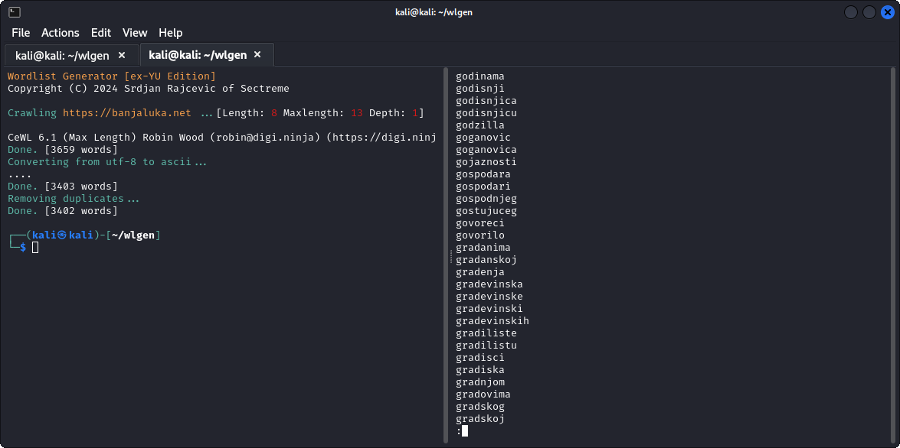

# wlgen
Word list generator for pentesters aiming ex YU targets



`wlgen` is a bash script for penetration testers seeking to generate wordlists for password cracking/guessing from web sites from Croatia, Bosnia, Serbia, Montenegro (ex-Yugoslavian countries speeking more-or-less the same language).
For web crawling and word fetching, `wlgen` relies on Robin Wood's [CeWL](https://github.com/digininja/CeWL) and checks for its presence together with other prerequisites (`ruby` and `git`) - if those are not installed, `wlgen` will install them together with gems that CeWL requires.
`wlgen` will crawl the web site, fetch all the words from it (by given min and max length parameters), convert all utf-8 latin-extended characters to ASCII equivalents, remove duplicates and sort the list saving it in `FQDN.wordlist` file.

Usage:
```bash
wlgen.sh -lmd URL
-l    minimal length of words to fetch
-m    maximum length of words to fetch
-d    depth of links to follow
URL   full url of site to fetch from
```
Example:
```bash
wlgen.sh -l 8 -m 13 -d 2 https://banjaluka.net
```
In the above example, `wlgen` crawls `https://banjaluka.net` with link depth of 2, fetching words that are between 8 and 13 chars long and saves the wordlist in `banjaluka.net.wordlist` file.


